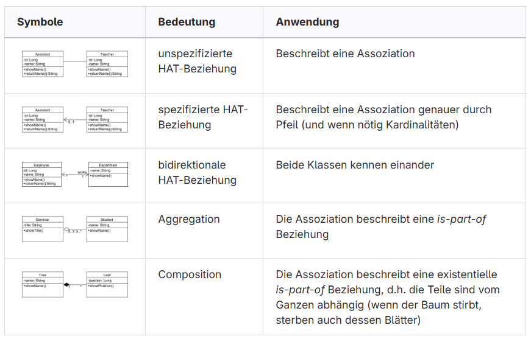
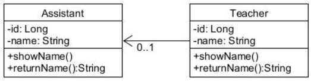

# UML Classdiagram

## Intro
- Unified modeling lamguage
- standatized, graphic modeling language
- different types: Aktivitätsdiagramm, Anwendungsfallsdiagramm, Klassendiagramm, Sequenzdiagramm and more

## Class diagram 
model for application that is object oriented and has classes.
class diagram shows static overview about all the classes an application has. Relationships can also be shown.

## Class structure 
- 3 rectangles with 3 rows
- class name
- class attributes (inkl. Symbol for Access Modifier)
- class methods

## most important symbols for relationships

## UML Tools
- draw.io
- starUML
- modelio
- UMLet
- violet
- visual paradigm online editor
- MS Visio

## Exercise
Kleine Übung
Erstellen Sie ein Klassendiagramm mit der korrekten Notation von Ihrem Programm, welches Sie für D1 erstellt haben. Zeichnen Sie auch die korrekten Beziehungen zwischen den Klassen.
Bilden Sie den Code für folgende Beziehung ab:

## Checkpoints
- what is a UML
- what is a class diagram
- meaning of symbols
- I can read a class diagram
- I know the relationships HAT and IST
- I can create a class diagram

## Useful links
https://www.visual-paradigm.com/guide/uml-unified-modeling-language/uml-class-diagram-tutorial/

