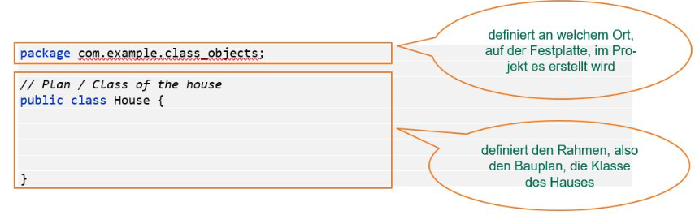
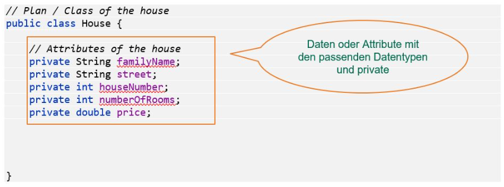
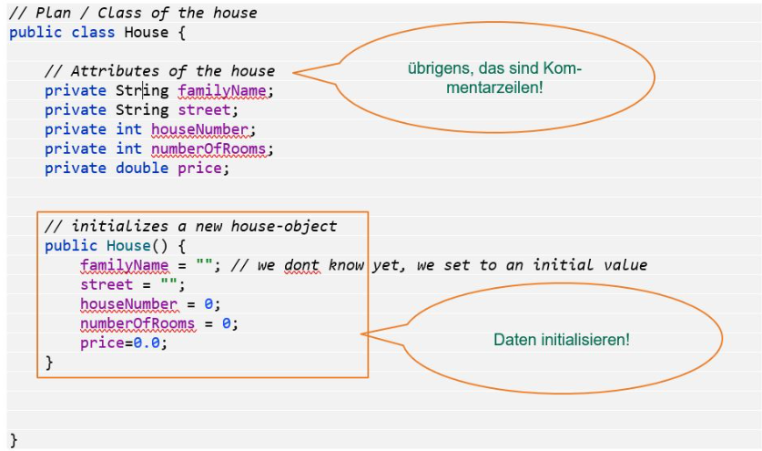
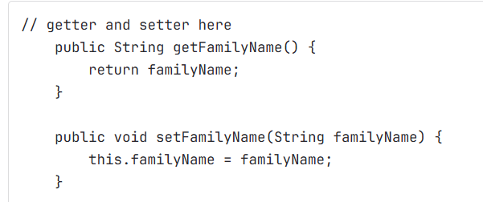
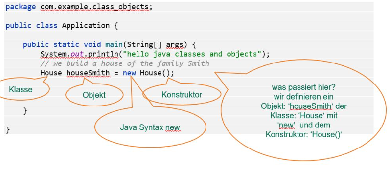
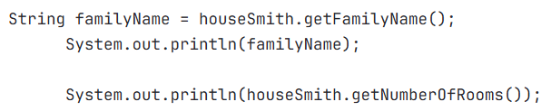

# classes and objects

## Blueprint - class
classes are blueprints for things. We can create objects with the classes and add attributes.

### basic framework

### attributes

### initialization with constructor

### access via getter and setter

### create object from house in testclass

### change states from object

## Checkpoints
- I know the difference between classes and objects
- I know how to structure a class 
- I know how to create objects from a class
- I know how to change the state from an object
- I know how to call methods from an object
- I know how to write a class
- I know how to initialize objects from a class