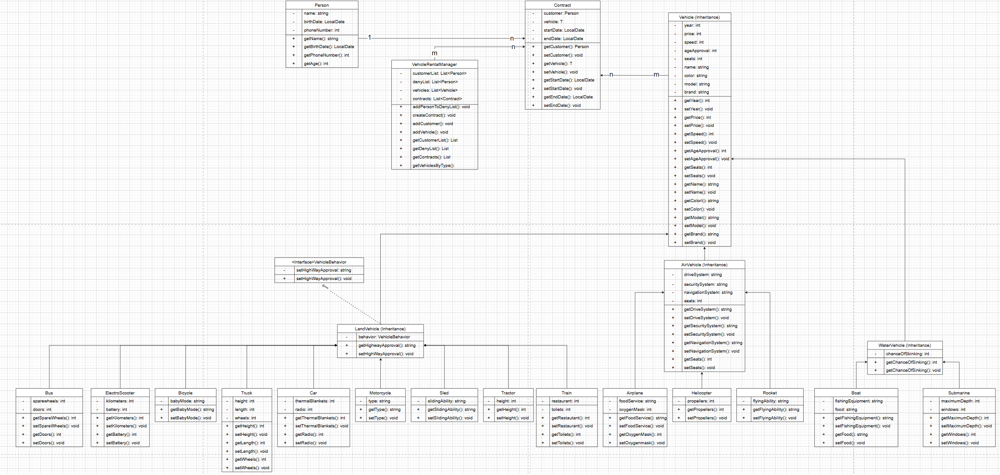
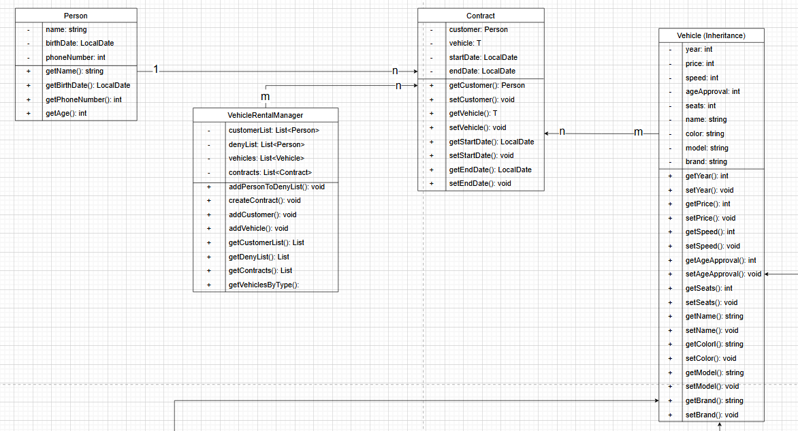
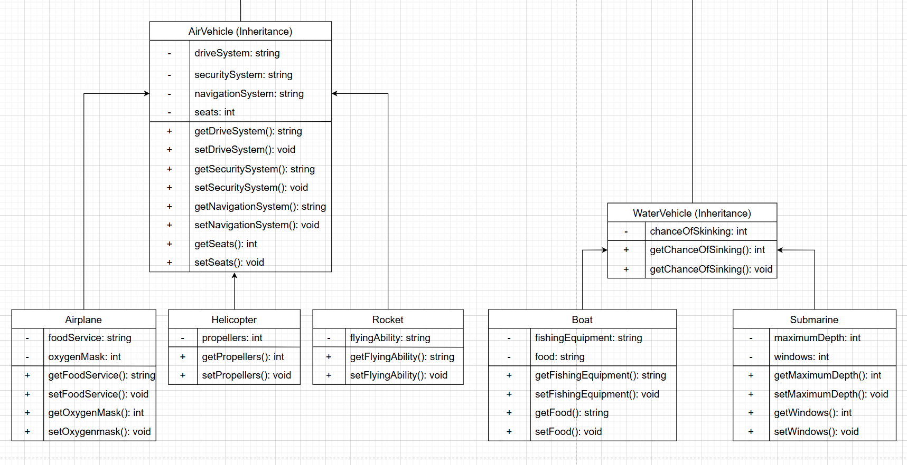
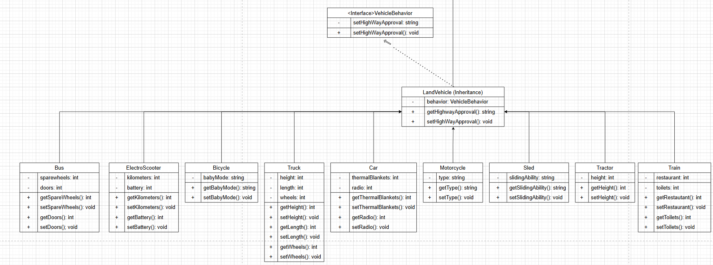

# UML diagram Vehicle Rental project

## Description
This is a vehicle rental game where you can rent a lot of different vehicles.  
For land, water and also air vehicles.  
We've implemented the project with multiple interfaces to avoid using the same code several times. 
You can see our structure on the pictures, there is a vehicle interface which is extended by the interfaces AirVehicle, WaterVehicle
and also AirVehicle interfaces. Then there are different vehicles such as submarine, car and rocket.
They all have a different price and individual attributes.  
There is also a class to create a contract and a class to register the person. To avoid several people renting the same car at the
same time, there are exceptions and exception handling is also implemented for age.

## UML

## Detailed images

# Sequence diagram Vehicle Rental project
