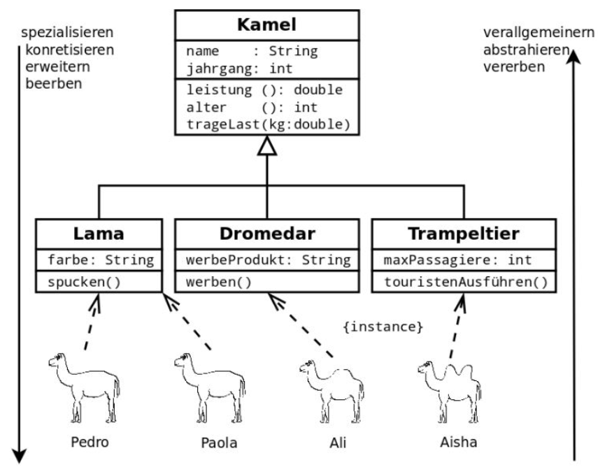

# Inheritance

## learning objectives
- I can create a hierarchie in the code with inheritance
- I can code IST-relationships
- I know how I can implement interfaces for the own class

## Reuse code with inheritance
To save code and prevent having to modify a lot of code we use inheritance. You can extend classes with attibutes and methods. 

## Abstraction with inheritance
We use a class as blueprint for objects. Our classes are abstractions of real objects that we use in the code. 

## Super classes and sub classes
When we have the same things in multiple classes we can use super classes. 

## Java example with extends
'''
public class Person {
    private String name ;
    private String vorname ;

    public void print () {
    System.out.println (" Nachname : ␣" + name );
    System.out.println (" Vorname : ␣ ␣" + vorname );
    }
}

public class Student extends Person {
    private String matrikelnummer ;
    public void printMatrikelnummer () {
    
    System.out.println (" Matrikelnummer : ␣ " + matrikelnummer );
}
'''

## Keyword super
'''
public class Human {
	
	
	private String name;
	
	/**
	 * Constructor
	 */
	public Human(String name) {
		this.name = name;
		
	}
}

public class Apprentice extends Human{
	
	private String topic;
	
	public Apprentice(String topic, String name){
		super(name);
        this.topic = topic;
		
	}
}
'''

## Checkpoint
- I know the principe of the inheritance 
- I know that we have to identify similarities to do a superclass with them
- I know how to implement inheritance in Java
- I know how to output attributes of the superclass in the subclasses.
